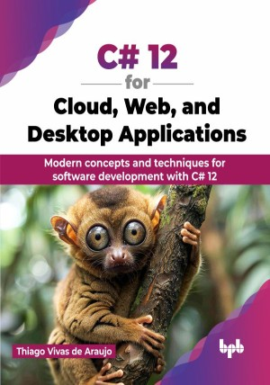

# C# 12 for Cloud, Web, and Desktop Applications

Modern concepts and techniques for software development with C# 12.

This is the repository for [C# 12 for Cloud, Web, and Desktop Applications
](https://bpbonline.com/products/c-12-for-cloud-web-and-desktop-applications?_pos=1&_sid=eea5aeeec&_ss=r&variant=43986559140040),published by BPB Publications.

## About the Book
The world of application development is constantly changing with the rise of open-source languages and technologies. Since Microsoft made the .NET platform and C# open-source in 2014, a vibrant community of developers has contributed to the language's evolution on GitHub. Microsoft releases a new version of .NET every year, leading to newer patterns, frameworks, and design approaches in active application development. 

Learn C# 11 & 12 and use Entity Framework Core for data management. Explore cloud development with Azure Functions, Azure SQL Database, Cosmos DB, and Blob Storage. Implement async communication with Azure Service Bus and secure apps with Azure Key Vault. Build web apps with Blazor and ASP.NET, and add real-time features with SignalR. Discover microservices with Web APIs, and streamline your workflow using Azure DevOps and Docker. Develop applications for mobile, desktop, and Windows with .NET MAUI, Blazor Hybrid, and WinUI.

Upon completion, readers will have a solid understanding of the latest C# features and how they fit into current design approaches. The book is not intended to be an exhaustive reference on the subject, but rather a jumping-off point for developers with some experience to begin working with the newest concepts. 

## What You Will Learn
• Learning the fundamentals of C# 12 programming language.

• Understanding advanced concepts like LINQ and asynchronous programming.

• Building web applications using ASP.NET Core, MVC and Blazor.

• Crafting cross-platform desktop applications using .NET MAUI.

• Unit testing using NUnit for robust code validation. 
